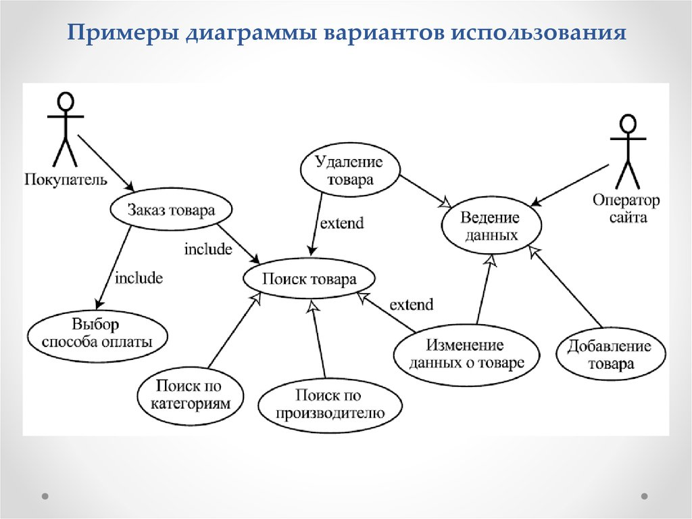
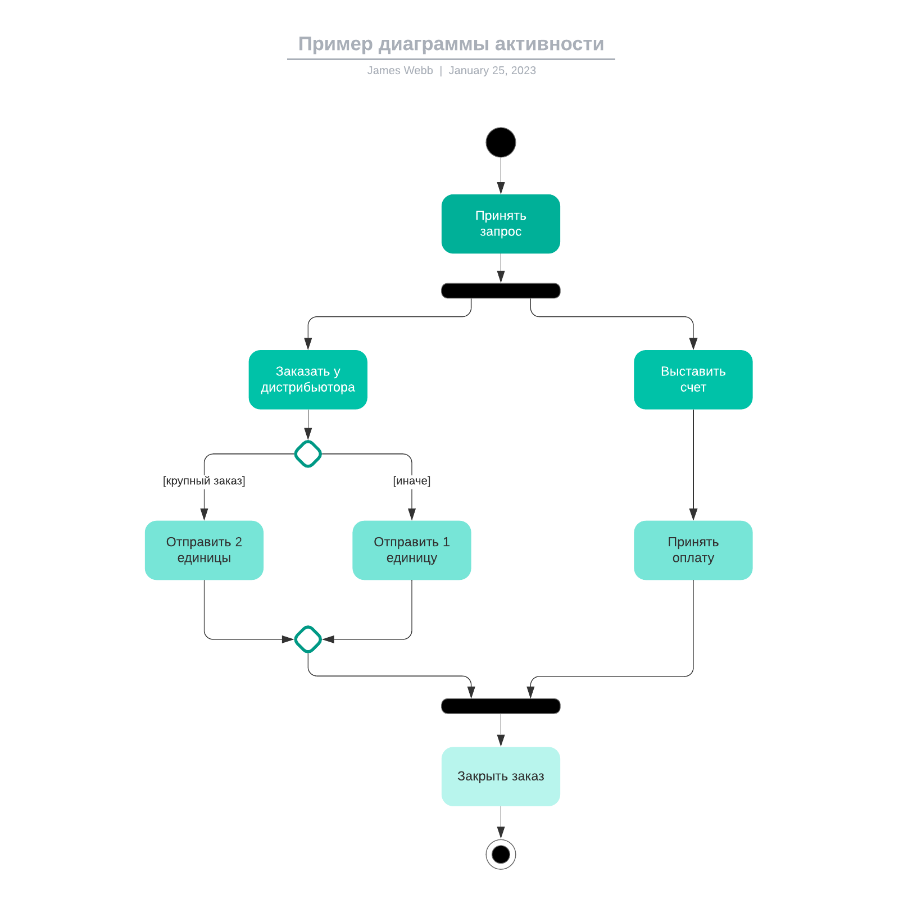
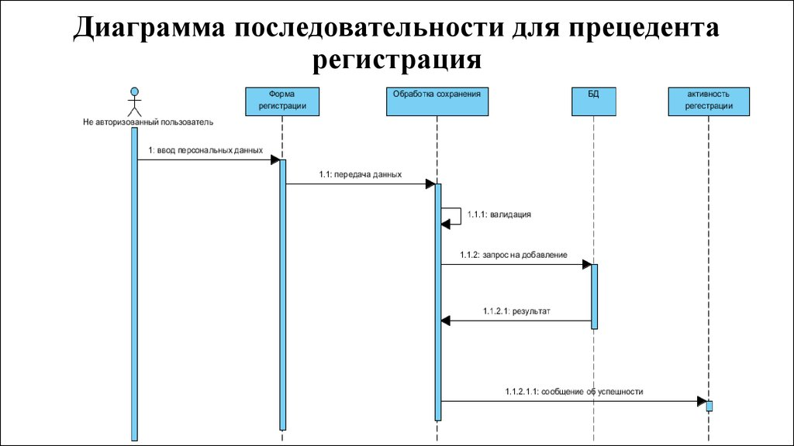
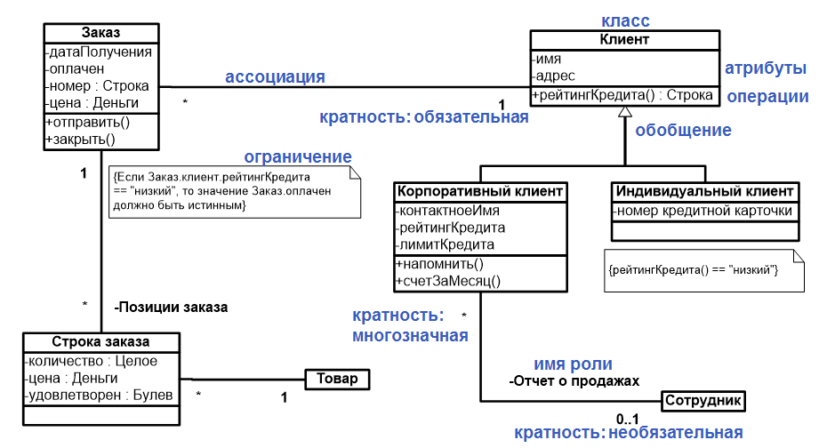
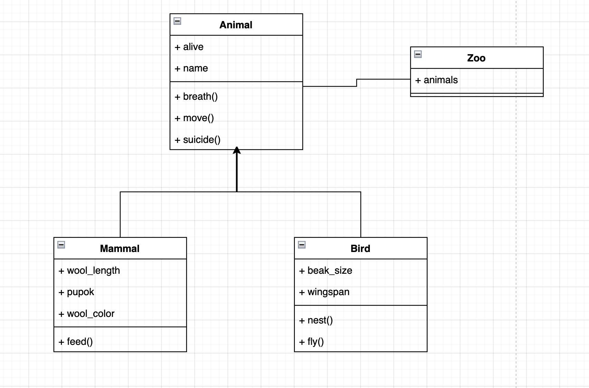

# Объектно-ориентированное проектирование

## Определение

Объектно-ориентированное проектирование (ООП) - это методология проектирования программного обеспечения, в которой система рассматривается как совокупность взаимодействующих объектов, каждый из которых представляет собой экземпляр класса.

ООП подразумевает проектирование системы, основываясь на принципах наследования, инкапсуляции и полиморфизма. Основная идея заключается в том, что программное обеспечение должно быть организовано в виде набора взаимодействующих объектов, каждый из которых обладает своими свойствами и методами.

Процесс объектно-ориентированного проектирования включает в себя следующие этапы:

+ Анализ требований: определение функциональных и нефункциональных требований к системе, ее пользователей и окружение.
+ Проектирование классов: создание диаграмм классов и определение атрибутов и методов каждого класса.
+ Проектирование отношений между классами: определение связей между классами, включая наследование, агрегацию и композицию.
+ Проектирование интерфейсов: определение интерфейсов для взаимодействия между объектами и классами.
+ Реализация: создание кода, реализующего объекты и классы, определенные на предыдущих этапах.
+ Тестирование: проверка работоспособности системы в соответствии с требованиями и спецификациями.

# UML

UML (Unified Modeling Language) — это стандартный нотационный язык моделирования, используемый для разработки программного обеспечения в объектно-ориентированных проектах. Он был разработан Object Management Group (OMG) и стал стандартом ISO 19501 в 2005 году.

UML предоставляет разработчикам инструменты и нотации для создания моделей различных аспектов программных систем, таких как структура системы, ее поведение, интерфейсы и взаимодействия между объектами. Эти модели могут быть использованы для понимания и описания требований к системе, ее архитектуры, анализа и проектирования.

UML включает в себя множество различных диаграмм, каждая из которых предназначена для моделирования конкретных аспектов системы. Некоторые из наиболее часто используемых диаграмм включают в себя:

+ Диаграмма прецедентов
+ Диаграмма активности
+ Диаграмма последовательности
+ Диаграмма классов

### Диаграмма прецедентов

Диаграмма прецедентов (Use Case Diagram) является одним из инструментов UML (Unified Modeling Language) и используется для моделирования функциональных требований к системе. Она представляет отношения между актерами (пользователями системы) и прецедентами (функциональными возможностями системы).

Диаграмма прецедентов состоит из следующих элементов:

+ Актеры - это пользователи системы или внешние системы, которые взаимодействуют с ней. Актеры представляются в виде человеческих или системных фигур.
+ Прецеденты - это функциональные возможности или задачи, которые система должна выполнять для своих актеров. Прецеденты представляются в виде овальных фигур.
+ Связи между актерами и прецедентами - это отношения между актерами и прецедентами, которые показывают, как актеры используют систему. Они представляются в виде стрелок.
+ Расширения и включения - это дополнительные возможности прецедентов, которые могут быть использованы при выполнении основного прецедента. Они представляются в виде пунктирных стрелок, и расширения обозначаются словом «extend», а включения - словом «include».
+ Границы системы - это прямоугольник, который представляет собой границы системы и все прецеденты, которые она включает.

### Диаграмма активности

Диаграмма активности (Activity Diagram) - это один из графических инструментов языка UML (Unified Modeling Language), используемый для моделирования бизнес-процессов и алгоритмов. Она представляет собой граф, в котором узлы представляют действия или решения, а дуги - переходы между действиями.

Диаграмма активности состоит из следующих элементов:

+ Начальное и конечное состояния - обозначают начало и конец процесса, соответственно. Начальное состояние обозначается кругом, а конечное - двойным кругом.
+ Действия - представляют собой шаги или операции в процессе и обозначаются прямоугольниками.
+ Решения - используются для ветвления потока выполнения в зависимости от условия. Решения обозначаются ромбами.
+ Дуги - связывают действия и решения и показывают, какой следующий шаг должен быть выполнен. Дуги могут иметь условия и маркировки, которые указывают, какой путь следует выбрать в зависимости от условий.
+ Синхронизация - используется для объединения двух или более потоков выполнения в один поток. Обозначается штрихованным прямоугольником.
+ Сообщения и объекты - используются для показа обмена сообщениями между объектами в системе.

### Диаграмма последовательности

Диаграмма последовательности (Sequence Diagram) - это один из графических инструментов языка UML (Unified Modeling Language), используемый для моделирования взаимодействия между объектами в системе. Она показывает, как объекты взаимодействуют друг с другом в последовательности шагов.

Диаграмма последовательности состоит из следующих элементов:

+ Объекты - представляют собой участников взаимодействия и обозначаются прямоугольниками с именем объекта в верхней части.
+ Сообщения - представляют собой вызовы методов объектов и показывают, какие методы вызываются и когда. Сообщения обозначаются стрелками, которые указывают направление передачи сообщения.
+ Активации - представляют собой периоды времени, когда объект выполняет метод. Активации показываются на диаграмме в виде вертикальных пунктирных линий, расположенных над объектами.
+ Фреймы - представляют собой контейнеры для активаций и сообщений и используются для группировки сообщений в логически связанные блоки.

### Диаграмма классов

Диаграмма классов (Class Diagram) - это графический инструмент языка UML (Unified Modeling Language), используемый для моделирования классов, их атрибутов, методов и взаимосвязей.

Диаграмма классов состоит из следующих элементов:

+ Классы - обозначаются прямоугольниками, которые содержат имя класса.
+ Атрибуты - показывают свойства класса и обозначаются внутри класса в виде переменных.
+ Методы - показывают действия, которые класс может выполнить, и обозначаются внутри класса в виде функций.
+ Ассоциации - показывают связи между классами и обозначаются линиями, которые соединяют классы.
+ Композиция и агрегация - используются для обозначения отношений часть-целое между классами.
+ Наследование - используется для обозначения отношений наследования между классами.

#### Правила

+ Имя класса должно быть уникально 
+ Имя класса должно начинаться с заглавной буквы
+ Класс может не иметь экземпляров или объектов. В этом случае он называется абстрактным классом, а для обозначения его имени используется курсив

#### Кванторы видимости

+ «+» - атрибут с областью видимости типа общедоступный (public)
+ «#» - атрибут с областью видимости типа защищенный (protected)
+ «-» - атрибут с областью видимости типа закрытый (private)

#### Пример

