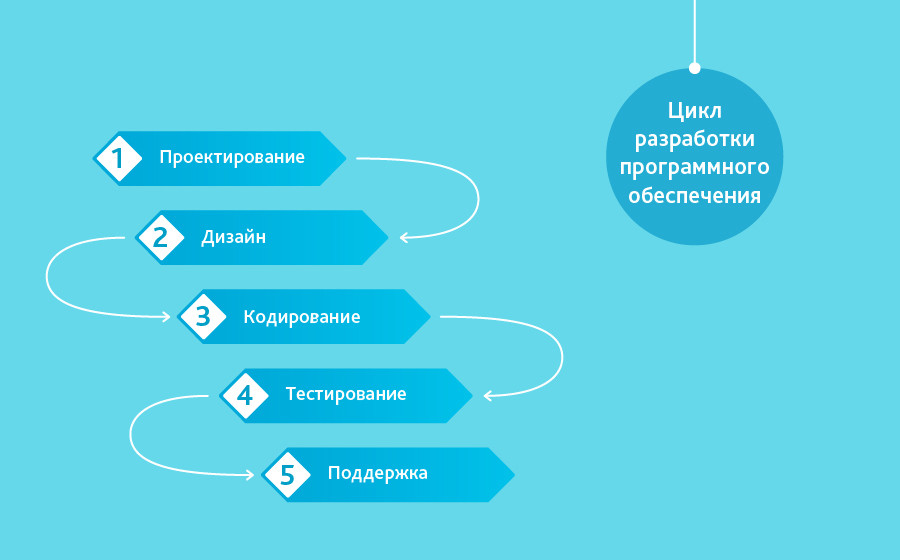
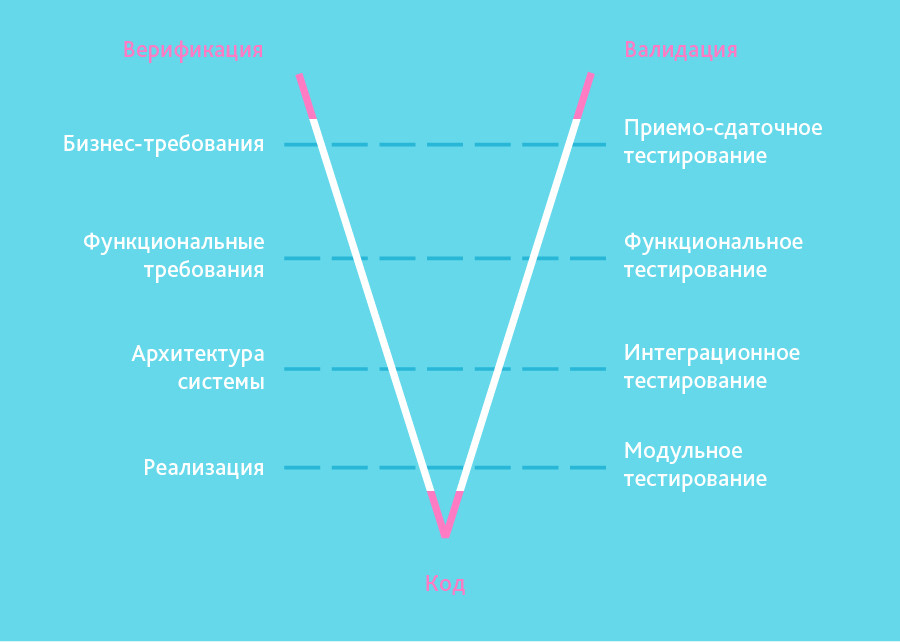
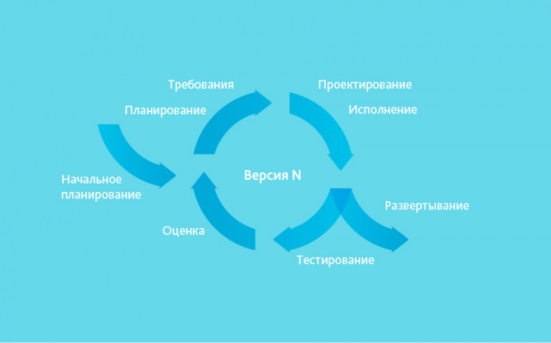
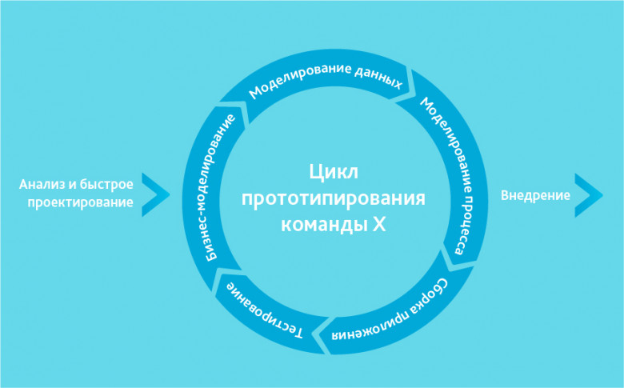
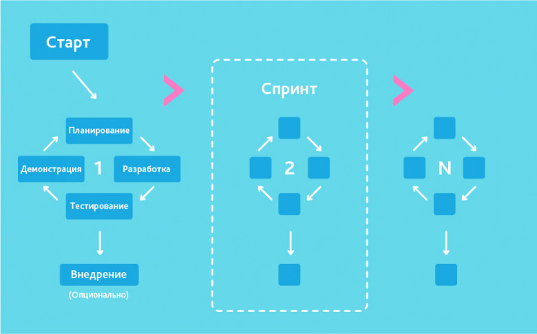
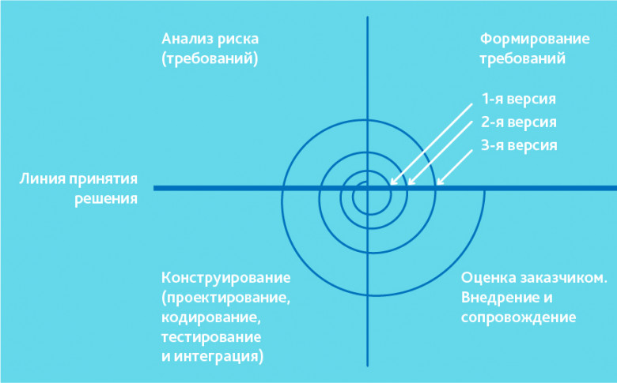

# Этапы разработки программного обеспечения

## Основные этапы разработки

Разработка проекта включает в себя несколько этапов, каждый из которых имеет свои характеристики и задачи. Общие этапы разработки проекта могут включать:

+ Исследование и планирование: В этом этапе исследуется и анализируется задача, которую необходимо решить. Задачи включают изучение потребностей пользователей, анализ конкурентов и оценку рынка. По итогам исследования определяются цели и задачи проекта, а также определяются необходимые ресурсы и бюджет.
+ Проектирование: На этом этапе проектируется структура, функциональность и интерфейс проекта. Разрабатываются диаграммы, макеты, прототипы и спецификации, которые позволяют определить все необходимые элементы проекта.
+ Разработка: На этом этапе происходит разработка кода, внедрение функциональности и создание дизайна проекта. Разработчики используют языки программирования, фреймворки и инструменты для создания программного обеспечения.
+ Тестирование: На этом этапе производится тестирование проекта на соответствие требованиям и целям проекта. Тестирование может проводиться вручную или автоматически с использованием специальных инструментов. В процессе тестирования выявляются ошибки и дефекты, которые необходимо исправить.
+ Внедрение: После успешного завершения тестирования проекта, он готов к внедрению в рабочую среду. На этом этапе происходит установка и настройка проекта на сервере или клиентском устройстве.
+ Сопровождение: После внедрения проекта в рабочую среду начинается период сопровождения. На этом этапе производится поддержка и обновление проекта, исправление ошибок и добавление новой функциональности.

## Основные методологии разработки

### Waterfall Model (каскадная модель или водопад)

Когда использовать каскадную методологию:

+ Только тогда, когда требования известны, понятны и зафиксированы. Противоречивых требований не имеется
+ Нет проблем с доступностью программистов нужной квалификации
+ В относительно небольших проектах

### V-Model

Когда использовать V-модель:

+ Если требуется тщательное тестирование продукта, то V-модель оправдает заложенную в себя идею: validation and verification
+ Для малых и средних проектов, где требования четко определены и фиксированы
+ В условиях доступности инженеров необходимой квалификации, особенно тестировщиков

### Incremental Model (инкрементная модель)

Когда использовать инкрементную модель:

+ Когда основные требования к системе четко определены и понятны. В то же время некоторые детали могут дорабатываться с течением времени
+ Требуется ранний вывод продукта на рынок
+ Есть несколько рисковых фич или целей

### RAD Model (rapid application development model или быстрая разработка приложений)

Когда используется RAD-модель:

Может использоваться только при наличии высококвалифицированных и узкоспециализированных архитекторов. Бюджет проекта большой, чтобы оплатить этих специалистов вместе со стоимостью готовых инструментов автоматизированной сборки. RAD-модель может быть выбрана при уверенном знании целевого бизнеса и необходимости срочного производства системы в течение 2-3 месяцев.

### Agile Model (гибкая методология разработки)

Когда использовать Agile:

+ Когда потребности пользователей постоянно меняются в динамическом бизнесе.
+ Изменения на Agile реализуются за меньшую цену из-за частых инкрементов.
+ В отличие от модели водопада, в гибкой модели для старта проекта достаточно лишь небольшого планирования.

### Iterative Model (итеративная или итерационная модель)

Когда оптимально использовать итеративную модель:

+ Требования к конечной системе заранее четко определены и понятны.
+ Проект большой или очень большой.
+ Основная задача должна быть определена, но детали реализации могут эволюционировать с течением времени.

### Spiral Model (спиральная модель)

Когда оптимально использовать спиральную модель:

«Спиральная модель» похожа на инкрементную, но с акцентом на анализ рисков. Она хорошо работает для решения критически важных бизнес-задач, когда неудача несовместима с деятельностью компании, в условиях выпуска новых продуктовых линеек, при необходимости научных исследований и практической апробации.
